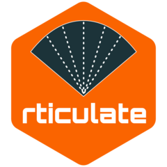

<!-- README.md is generated from README.Rmd. Please edit that file -->

# rticulate: Articulatory data processing in R 

<!-- badges: start -->

[](https://cran.r-project.org/package=rticulate)
[](https://cran.r-project.org/web/checks/check_results_rticulate.html)
[](https://github.com/stefanocoretta/rticulate/actions)
[](https://github.com/stefanocoretta/rticulate)
[](https://doi.org/10.5281/zenodo.1469038)
<!-- badges: end -->

This is the repository of the R package `rticulate`. This package
provides two functions for importing UTI data from Articulate Assistant
Advanced™ (both Deep Lab Cut and legacy fan-line spline data) and
electro-magnetic articulographic data from a Carstens AG500.

## Installation

The package is on CRAN, so you can install it from there with
`install.packages("rticulate")`.

If you like living on edge, install a polished pre-release with:

``` r
remotes::install_github(
  "stefanocoretta/rticulate",
  build_vignettes = TRUE
)
```

Or the development version with:

``` r
remotes::install_github(
  "stefanocoretta/rticulate@devel",
  build_vignettes = TRUE
)
```

## Usage

For an overview of the package functionalities covered in the vignettes,
run `vignette("overview", package = "rticulate")` after the
installation.
