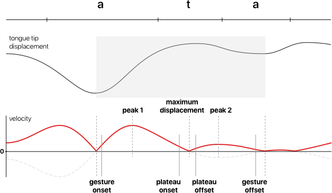

```{r, include = FALSE}
knitr::opts_chunk$set(
  collapse = TRUE,
  comment = "#>",
  fig.width = 7
)
```

In this vignette, we will illustrate how to extract kinematic (gestural) landmarks from displacement signals.

## Read the data

```{r setup}
library(tidyverse)
library(rticulate)
```

```{r it01-dlc}
it01_dlc_path <- system.file("extdata/it01-dlc.tsv", package = "rticulate")

it01_dlc <- read_aaa(it01_dlc_path) |> 
  # Let's rename some columns.
  rename(
    date_time = `Date Time of recording`,
    time_rec = `Time of sample in recording`,
    time_annot = `Time of sample in annot`
  )
```

Let's plot the smoothed and resampled displacement signal on the Y axis of knot 8 (Blade 2).

```{r it01-up}
it01_up <- it01_dlc |> 
  filter(spline == "DLC_Tongue") |> 
  mutate(
    Y_sm = filter_signal(Y, order = 2, window_length = 7, apply = 2),
    .by = c(displ_id)
  ) |> 
  reframe(
    resample_signal(Y_sm, time_annot, by = 3), .by = c(displ_id, knot)
  ) |> 
  mutate(
    Y_sm_up = filter_signal(signal_int, window_length = 11, apply = 2),
    .by = c(displ_id, knot)
  )

it01_up |> 
  filter(knot == 8) |> 
  ggplot(aes(time_int, Y_sm_up)) +
  geom_point(alpha = 0.2) +
  facet_wrap(vars(displ_id))
```

## Get the velocity of displacement

To obtain gestural landmarks, it is necessary to calculate the velocity (i.e. the first derivative) of the displacement signal. This package has a `get_velocity()` function which calculates the velocity of a signal.

Note that calculating the derivative of a signal returns a vector that is one item shorter than the original signal vector we get the derivative of. `get_velocity()` adds a `NA` at the beginning of the output vector to correct for that.

The following code chunk illustrates the use of `get_velocity()` on a single signal (`displ_id = 14`) and plots the results.

```{r get-velocity, warning=FALSE}
it01_up <- it01_up |> 
  mutate(
    Y_sm_up_vel = get_velocity(Y_sm_up)
  )

it01_up |> 
  filter(displ_id == 14) |> 
  ggplot(aes(time_int, Y_sm_up_vel)) +
  geom_point() +
  geom_line(aes(y = abs(Y_sm_up_vel)), colour = "red") +
  annotate("rect", xmin = 0.3, xmax = 0.55, ymin = -Inf, ymax = Inf, alpha = 0.3)
```

The black dots represent the calculated velocity of the signal while the red line is the absolute velocity (i.e. the speed). Absolute velocity is used by the `get_landmarks()` function to obtain the landmarks (you will see how to use this function in the next section).

The grey area indicates the approximate location of the tongue blade raising and lowering in the sequence /ata/.

## Gestural landmarks

The following schematics illustrates the relation between the displacement signal, the velocity and absolute velocity signals, and the gestural landmarks.



- **Peak 1 and peak 2**: they are the peak closing absolute velocity and peak opening absolute velocity. The time of these landmarks indicate the time in which the displacement reaches maximum (i.e. peak) velocity.
- **Maximum displacement**: this is the minimum absolute velocity between peak 1 and 2, and corresponds to the time of maximum displacement.
- **Gesture onset and offset**: these indicate the onset and offset of the closing-opening gesture. They are calculated as the time in which the opening absolute velocity before peak 1 is 20% of the peak 1 absolute velocity and as the time in which the closing absolute velocity after peak 2 is 20% of the peak 2 absolute velocity.
- **Plateau onset and offset**: these indicate the approximate onset and offset of the displacement plateau (when the articulator minimally moves around the time of maximum displacement). These are calculated as the time in which the absolute velocity before and after maximum displacement is 20% of the peak 1 and peak 2 absolute velocities respectively.

The following code illustrates the use of `get_landmarks()` with the same single displacement signal from above (`displ_id == 14`).

For the `get_landmarks()` function to function correctly, the user has to select a time window within which the maximum displacement (i.e. the minimum velocity) will be searched. The window should not contain any other velocity minima. For consonants, a good reference is the start and end of the consonant closure as obtained from acoustics. To make things easier, here I am selecting a single window for all displacement signals, which happens to work fine.

I also recommend to run the function on the signal within a reduced time window which includes the opening-closing gesture only. This will help reducing the erroneous detection of other peaks/minima in the signal.

```{r get-landmarks, warning=FALSE}
# Filter signal to include a reduced time window
it01_up_win <- it01_up |>
  filter(displ_id == 14, time_int > 0.3, time_int < 0.55)

# Get landmarks
it01_up_win_land <- get_landmarks(it01_up_win$Y_sm_up_vel, it01_up_win$time_int, 0.4, 0.5)
it01_up_win_land_long <- it01_up_win_land |> 
  pivot_longer(everything(), names_to = "land")

it01_up_win_land_long
```

The following plots show the gestural landmarks overlaid on the absolute velocity (top) and on the displacement (bottom).

```{r plot-landmarks, warning=FALSE, fig.asp=0.25}
it01_up_win |> 
  ggplot(aes(time_int, abs(get_velocity(Y_sm_up)))) +
  geom_point(colour = "red") +
  geom_vline(data = it01_up_win_land_long |> filter(str_detect(land, "_ons|_off")), aes(xintercept = value)) +
  labs(y = "Absolute velocity")

it01_up_win |> 
  ggplot(aes(time_int, Y_sm_up)) +
  geom_point() +
  geom_vline(data = it01_up_win_land_long |> filter(str_detect(land, "_ons|_off")), aes(xintercept = value)) +
  labs(y = "Y displacement")
```

Let's now get gestural landmarks for all the knot 8 data.

```{r it01-up-lands}
it01_up_lands <- it01_up |> 
  filter(knot == 8, time_int > 0.3, time_int < 0.55) |> 
  reframe(
    get_landmarks(Y_sm_up_vel, time_int, 0.35, 0.45),
    .by = displ_id
  )

it01_up_lands
```

And finally, let's plot the gestural landmarks!

```{r}
it01_up_lands_long <- it01_up_lands |> 
  pivot_longer(-displ_id, names_to = "land")

it01_up |> 
  filter(knot == 8) |> 
  ggplot(aes(time_int, Y_sm_up)) +
  geom_point(alpha = 0.2) +
  geom_vline(data = it01_up_lands_long |> filter(str_detect(land, "_ons|_off")), aes(xintercept = value)) +
  facet_wrap(vars(displ_id))
```

